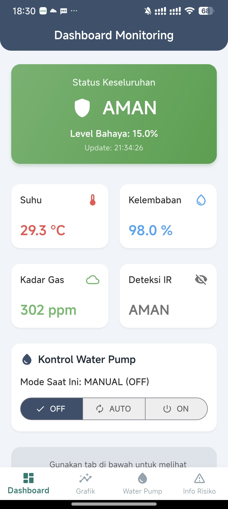
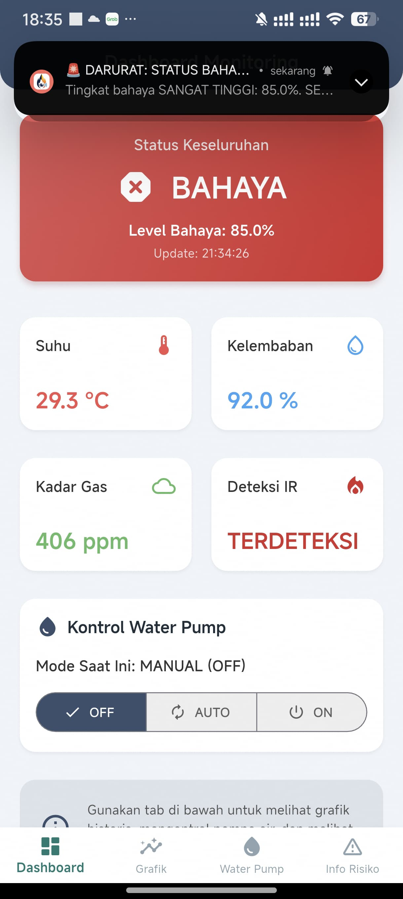
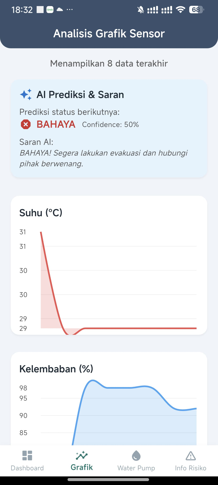
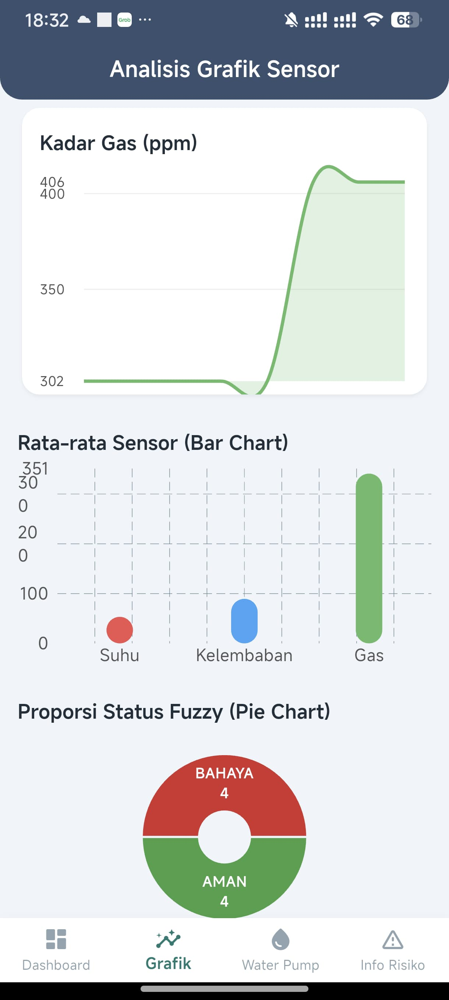
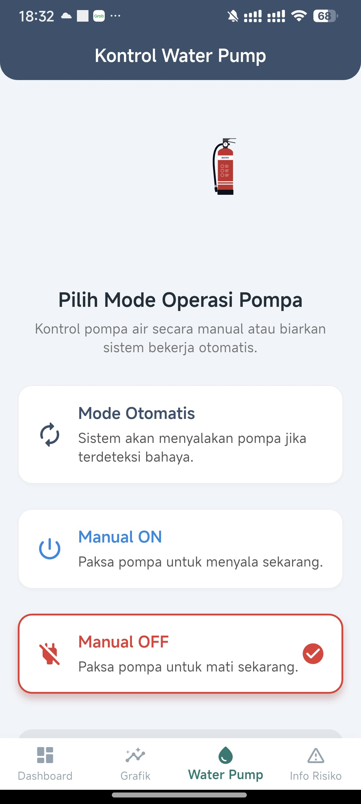

# FireDetection IoT App

A modern, smart, and minimalistic Flutter dashboard for real-time fire detection and water pump control, powered by Firebase and fuzzy logic.

---

## 🚀 Overview

**FireDetection** is an IoT-based mobile app designed to monitor fire risk in real time, visualize sensor data, and control a water pump remotely. Built with Flutter, it features a beautiful, minimal UI inspired by Tailwind/ShadCN, dark mode, and advanced AI-driven analysis.

---

## 🗺️ Alur Kerja Sistem


---

## ✨ Features

- **Real-Time Fire Monitoring:**
  - Live sensor data (temperature, humidity, gas, IR fire detection) from Firebase.
  - Fuzzy logic status: AMAN (Safe), WASPADA (Alert), BAHAYA (Danger).
- **Smart Notification System:**
  - Instant alerts with custom sounds for WASPADA and BAHAYA statuses.
- **Water Pump Control:**
  - Manual (ON/OFF) and AUTO modes, matching Arduino/ESP logic.
  - Real-time status feedback and control from the app.
- **Modern Dashboard UI:**
  - CardSwiper for status/risk cards.
  - Minimal, responsive design with dark mode support.
- **Advanced Data Visualization:**
  - Line, bar, and pie charts for sensor history and risk proportions.
  - AI-powered status prediction, confidence, and smart advice.
- **Splash Screen:**
  - Lottie animation intro for a professional look.
- **Risk Info Page:**
  - Fuzzy logic table with color-coded actions and explanations.
- **Fully Commented Code:**
  - High-level comments for easy understanding and maintenance.

---

## 📱 Screenshots









---

## 🛠️ Tech Stack

- **Flutter** (Dart 2.18+)
- **Firebase Realtime Database**
- **fl_chart** (data visualization)
- **lottie** (animations)
- **flutter_local_notifications** (alerts)

---

## 🔧 Setup & Installation

1. **Clone the repository:**
   ```bash
   git clone https://github.com/yourusername/FireDetection.git
   cd FireDetection
   ```
2. **Install dependencies:**
   ```bash
   flutter pub get
   ```
3. **Add Firebase config:**
   - Place your `google-services.json` (Android) and `GoogleService-Info.plist` (iOS) in the correct folders.
4. **Add Lottie assets:**
   - Place `assets/intro.json` and `assets/water.json` in the `assets/` directory.
5. **Run the app:**
   ```bash
   flutter run
   ```

---

## 🤖 How It Works

- The app listens to sensor data from Firebase and updates the dashboard in real time.
- Fuzzy logic determines the risk status and triggers notifications with custom sounds.
- Users can control the water pump remotely, with logic matching the Arduino/ESP firmware.
- The analysis page provides AI-driven predictions, confidence, and actionable advice.
- All UI is responsive, modern, and supports dark mode.

---

## 💡 Project Structure

- `lib/main.dart` — Main app logic, UI, and comments.
- `assets/` — Lottie animations and sound files.
- `android/`, `ios/`, `web/`, `linux/`, `macos/`, `windows/` — Platform-specific code.

---

## 🙌 Credits

- Developed by Dhiya Ulhaq — 2025
- Inspired by modern IoT, Flutter, and UI/UX best practices.

---

## 📄 License

This project is licensed under the MIT License.
"# FireDetectionMonitoring" 
